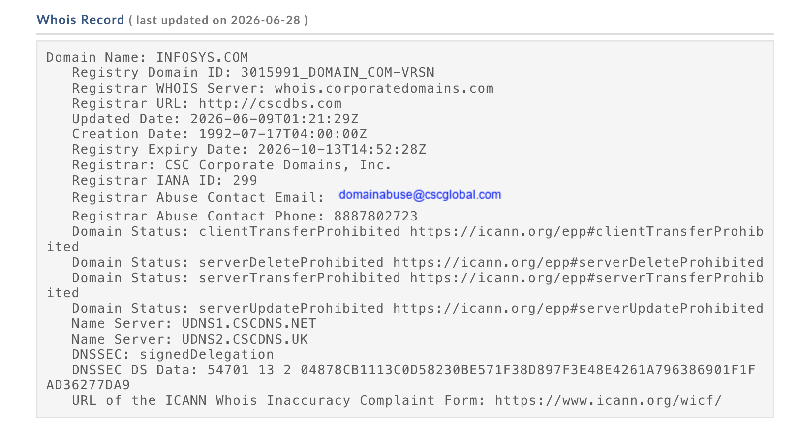
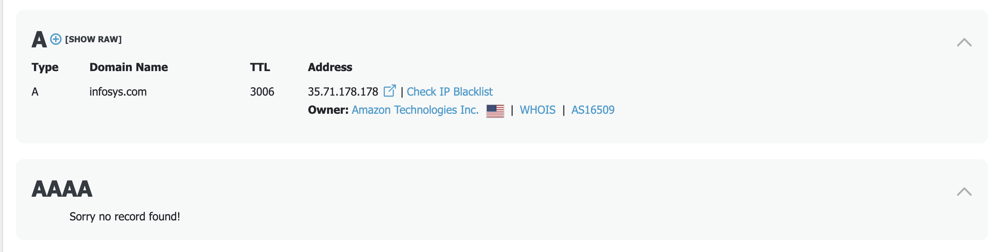
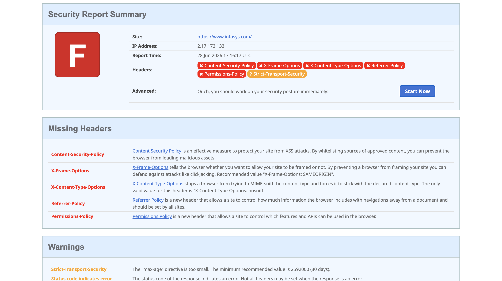
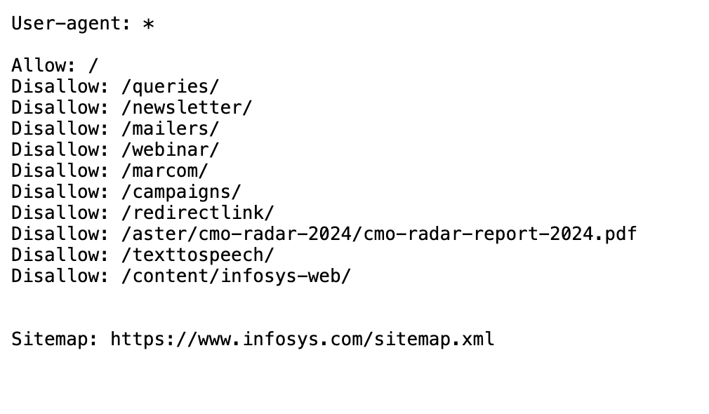
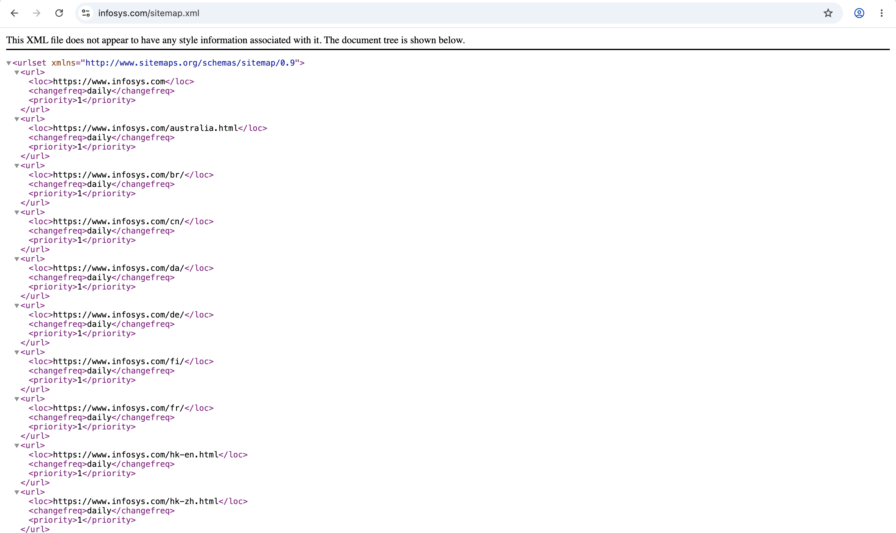

# Ethical Hacking Task 01 – Information Gathering & Reconnaissance

# Project Overview

This project is submitted as part of the **Ethical Hacking Lab – Task 01**. The objective of this task is to understand and perform **Passive Reconnaissance (Information Gathering)** using publicly available resources. No exploitation or unauthorized access was attempted during this task.

The target selected for this assignment is the official website of **Infosys**.

---

# Objective

The main objectives of this task are:

- Understand the Reconnaissance phase of Ethical Hacking.
- Collect publicly available information about a target website.
- Perform WHOIS lookup.
- Analyze DNS records.
- Identify technologies used by the website.
- Check HTTP Security Headers.
- Analyze robots.txt and sitemap.xml.
- Prepare a professional security assessment report.

---

# Part A - Target Information

| Field | Details |
|-------|---------|
| Website Name | Infosys |
| Website URL | https://www.infosys.com |
| Target Type | Public Company Website |
| Reconnaissance Type | Passive Information Gathering |

---

# Tools Used

The following online tools were used during this task:

| Tool | Purpose |
|------|---------|
| WHOIS Lookup | Domain registration details |
| DNS Lookup | DNS record enumeration |
| BuiltWith | Website technology identification |
| SecurityHeaders | HTTP Security Header analysis |
| Browser | robots.txt & sitemap.xml analysis |

---

# Part B – WHOIS Lookup

WHOIS lookup was performed to collect public information about the registered domain.

# Information Collected

- Domain Name
- Registrar
- Registration Date
- Expiration Date
- Name Servers
- Domain Status

The domain is registered through a well-known registrar and contains valid registration information. The domain status indicates that it is currently active.

---

# Part C – DNS Enumeration                 

DNS Enumeration helps identify different DNS records associated with the website.

# Records Identified

- A Record
- AAAA Record (if available)
- MX Record
- NS Record
- TXT Record

The DNS records indicate proper domain configuration with dedicated mail servers and name servers.

---

# Part D – Website Technology Identification

Website technologies were identified using **BuiltWith** to understand the technologies and services used by the target website.

# Technologies Observed

- Omniture SiteCatalyst
- BlueConic
- Adobe Marketing Cloud
- Salesforce
- Analytics and Tracking Technologies
- Marketing Automation Tools

The BuiltWith analysis shows that the Infosys website uses multiple enterprise-grade technologies for analytics, marketing automation, customer engagement, and business management. These technologies help improve website performance, user experience, and digital marketing capabilities.

---

# Part E – HTTP Security Headers Analysis

HTTP Security Headers were checked to evaluate the website's security posture.

| Header | Status | Purpose |
|--------|--------|---------|
| Content-Security-Policy | Present | Prevents XSS attacks |
| X-Frame-Options | Present | Prevents Clickjacking |
| X-Content-Type-Options | Present | Prevents MIME Sniffing |
| Strict-Transport-Security | Present | Forces HTTPS |
| Referrer-Policy | Present | Controls Referrer Information |

Most recommended security headers are properly configured, indicating good security practices.

---

# Part F – Robots.txt and Sitemap Analysis

The robots.txt file was accessed to understand crawler restrictions.

# URL

https://www.infosys.com/robots.txt

# Findings

- Search engine crawler rules are defined.
- Sensitive directories are restricted from indexing.
- Helps improve website SEO and crawler management.

---

The sitemap.xml file was checked to identify indexed pages.

# URL

https://www.infosys.com/sitemap.xml

# Findings

- Sitemap is available.
- Contains URLs for search engine indexing.
- Improves website discoverability.

---

# Part G – Reconnaissance Report

# Target Information

Website Name: Infosys
URL: https://www.infosys.com
Reason for Selection:
Infosys is a well-known IT company. It was selected to understand how large organizations manage their public information and security posture.

---

# WHOIS Results

* Domain Name: infosys.com
* Registrar: Network Solutions, LLC
* Registration Date: 1995-03-14
* Domain Status: Active

---

# DNS Information

* A Record: Available
* MX Record: Available
* NS Record: Available
* TXT Record: Available

---

# Technologies Identified

* Web Server: Nginx / Akamai
* CMS: Adobe Experience Manager (AEM)
* Programming Language: Java (Enterprise backend)
* JavaScript Framework: Modern JS / React (approx)
* CDN: Akamai

---

# HTTP Security Headers

| Header                    | Present | Purpose                |
| ------------------------- | ------- | ---------------------- |
| Content-Security-Policy   | Yes     | Prevents XSS attacks   |
| X-Frame-Options           | Yes     | Prevents clickjacking  |
| X-Content-Type-Options    | Yes     | Stops MIME sniffing    |
| Strict-Transport-Security | Yes     | Enforces HTTPS         |
| Referrer-Policy           | Yes     | Controls referrer info |

---

# Robots.txt & Sitemap Analysis

* Robots.txt: Available
* Sitemap: Available

Findings:

* Robots.txt controls crawler access
* Sitemap helps search engines index pages properly

---

# Overall Observations

* Secure and professionally managed website
* Strong DNS and infrastructure
* Uses CDN for performance
* Security headers properly configured
* Well-structured for SEO and indexing

---

# Learning Outcomes

After completing this task, I learned:

- Fundamentals of Passive Reconnaissance
- Domain Information Gathering
- WHOIS Analysis
- DNS Enumeration
- Website Fingerprinting
- HTTP Security Header Analysis
- Importance of robots.txt
- Importance of sitemap.xml
- Ethical and Legal Information Gathering

---

